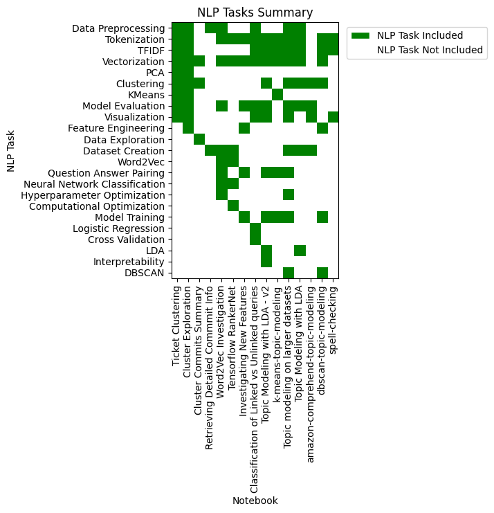
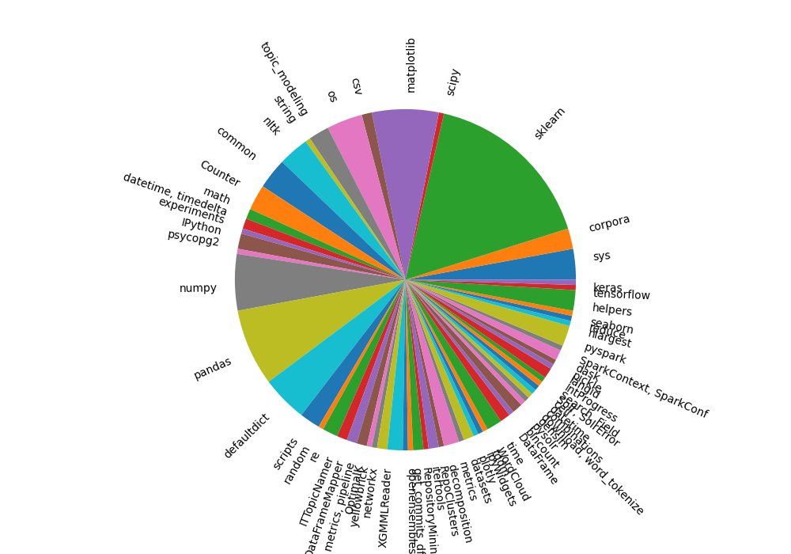
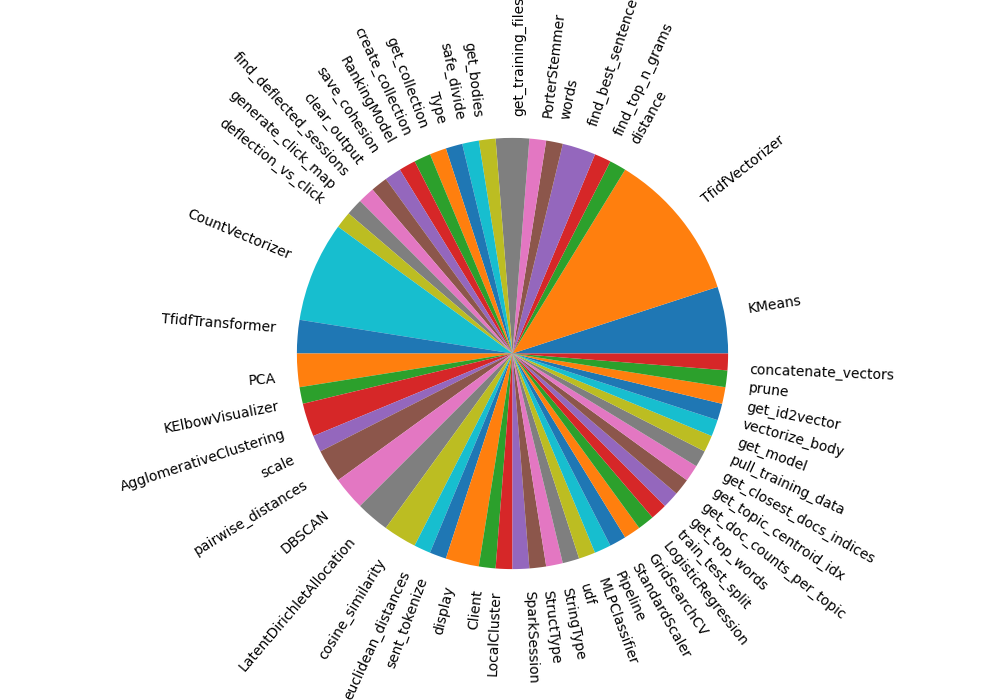
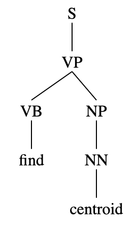

# nlp notebook portfolio
My portfolio of natural language processing Jupyter Notebooks. These were developed as part of my work as a Data Scientist at the start-up IT.com. These notebooks demonstrate expertise in the full machine learning pipeline, in Python development within Jupyter notebooks, and in a wide variety of NLP tasks. 

## notebooks

| Title | Date | NLP Tasks | Python Packages |
| -------------- | ---- | --------- | --------------- |
| [Ticket Clustering](notebooks/Ticket%20Clustering.ipynb) | Dec 2019 | Data Preprocessing, Tokenization, TFIDF, Vectorization, PCA, Clustering, KMeans, Model Evaluation, Visualization  | matplotlib, pandas, numpy, nltk, networkx, sklearn |
| [Cluster Exploration](notebooks/Cluster%20Exploration.ipynb) | Dec 2019 | Data Preprocessing, Feature Engineering, Tokenization, TFIDF, Vectorization, PCA, Clustering, KMeans, Model Evaluation, Visualization | matplotlib, networkx, numpy, openensembles, pandas, sklearn  |
| [Cluster Commits Summary](notebooks/Cluster%20Commits%20Summary.ipynb) | Dec 2019 | Data Exploration, Vectorization, Clustering | pandas, ipywidgets |
| [Retrieving Detailed Commmit Info](notebooks/Retrieving%20Detailed%20Commit%20Info.ipynb) | Dec 2019 | Dataset Creation, Data Preprocessing | networkx, pandas, pydriller |
| [Word2Vec Investigation](notebooks/Word2Vec%20Investigation.ipynb) | Nov 2018 | Tokenization, Vectorization, Word2Vec, Question Answer Pairing, Dataset Creation, Data Preprocessing, Neural Network Classification, Hyperparameter Optimization, Model Evaluation | gensim, numpy, nltk, sklearn |
| [Tensorflow RankerNet](notebooks/Tensorflow%20RankerNet.ipynb) | Nov 2018 | Dataset Creation, Tokenization, Vectorization, Word2Vec, Computational Optimization, Neural Network Classification | numpy, pandas, ipywidgets, tensorflow, keras |
| [Investigating New Features](notebooks/Investigating%20New%20Features.ipynb) | Nov 2018 | Question Answer Pairing, Tokenization, Vectorization, Feature Engineering, Model Training, Model Evaluation  | matplotlib, numpy, psycopg2  |
| [Classification of Linked vs Unlinked queries](notebooks/Classification%20of%20Linked%20vs%20Unlinked%20queries.ipynb) | Oct 2018 | Data Preprocessing, Tokenization, Vectorization, TFIDF, Logistic Regression, Model Evaluation, Cross Validation, Visualization | sklearn, matplotlib, numpy, pysolr, seaborn |
| [Topic Modeling with LDA - v2](notebooks/Topic%20Modeling with%20LDA%20-%20v2.ipynb) | July 2018 | Question Answer Pairing, Tokenization, Vectorization, TFIDF, Model Training, LDA, Clustering, Model Evaluation, Visualization, Interpretability | pandas, matplotlib, numpy, sklearn |
| [k-means-topic-modeling](notebooks/k-means-topic-modeling.ipynb) | July 2018 | Question Answer Pairing, Tokenization, Vectorization, TFIDF, Model Training, KMeans | csv, matplotlib, sklearn |
| [Topic modeling on larger datasets](notebooks/Topic%20modelling%20on%20larger%20datasets.ipynb) | June 2018 | Question Answer Pairing, Dataset Creation, Data Preprocessing, Tokenization, Vectorization, TFIDF, Model Training, Clustering, DBSCAN, Hyperparameter Optimization, Model Evaluation, Visualization| pandas, matplotlib, numpy, sklearn, |
| [Topic Modeling with LDA](notebooks/Topic%20Modeling%20with%20LDA.ipynb) | May 2018 | Dataset Creation, Data Preprocessing, Clustering, LDA, Tokenization, Vectorization, TFIDF, Model Evaluation | nltk, pandas, numpy, sklearn |
| [amazon-comprehend-topic-modeling](notebooks/amazon-comprehend-topic-modeling.ipynb) | May 2018 | Dataset Creation, Clustering, Model Evaluation, Visualization| csv, pandas, numpy, matplotlib|
| [dbscan-topic-modeling](notebooks/dbscan-topic-modeling.ipynb) | May 2018 | Tokenization, Vectorization, TFIDF, Feature Engineering, Model Training, Clustering, DBSCAN | pandas, sklearn |
| [spell-checking](notebooks/spell-checking.ipynb) | May 2018 | Tokenization, TFIDF, Visualization | nltk, matplotlib |

The following is a 2D plot that summarizes the NLP Tasks involved in each of the notebooks. See [Counter for NLP Tasks in README.md table](portfolio-inspector.ipynb#counter-for-nlp-tasks-in-readme-md-table) for the process and code that generates the plot. 

## portfolio-inspector

I've created and developed the [portfolio-inspector notebook](portfolio-inspector.ipynb) to explore and analyze the contents of all of the notebooks. 

### top-level imports from all notebooks
The following pie chart shows the distribution of module imports within all of the notebooks. 

To compute the counts, I created a regular expression to capture the import statements (see the section [regex for extracting imports](portfolio-inspector.ipynb#regex-for-extracting-imports)) from a given notebook. I created a `dict` to store the results of the regex search. For example, `{'module': 'nltk', 'path': ['stem', 'porter'], 'functions': ['PorterStemmer']}`. This representation neatly stores both the top-level module, the specific path of the imported function/class, and the imported functions/classes. I then use a `Counter` to compute the counts of the imports (see section [counter for imports](portfolio-inspector.ipynb#counter-for-imports)) before finally computing the counts for all of the imports from all of the notebooks (see the section [Counter of all top-level module imports from all notebooks](portfolio-inspector.ipynb#counter-of-all-top-level-module-imports-from-all-notebooks)).

### imported functions/classes from all notebooks
The following pie chart shows the distribution of imported functions within all of the notebooks.

### parsing function names
I'm curious to see how many of the user-defined functions names are verb phrases. After scraping all of the notebooks, 128 function names are retrieved. Using the [Constituent Treelib](https://github.com/Halvani/Constituent-Treelib), I parsed all of the function names, creating a parse tree for each one, as shown by the following example:

After parsing each of the 128 function names, 36 of them (28%) were parsed as verb phrases. However this is a large underestimate based on a look at the list of function names. Given that these function names are mostly short bigrams and trigrams, the parser is not provided a full sentence with context to determine the parsing of the function name as a verb phrase. That leaves room for ambiguity in parsing and errors in computing a parse tree. `Constituent-Treelib` also detects the language of the input sentence, and given the short phrases and use of programming jargon in the function names, 62 of the function names were unable to be parsed due to a language detection error. In total, 53 of the function names were successfully parsed and so the 36 function names containing a verb phrase represents 68% of the parsed function names. 